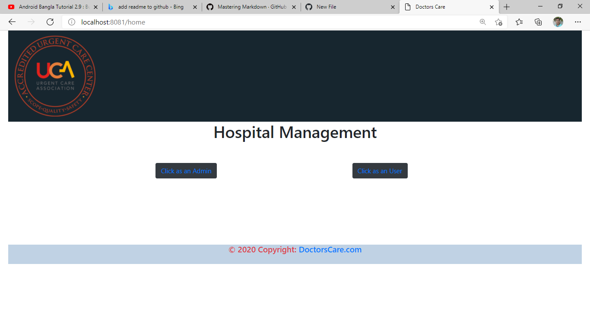
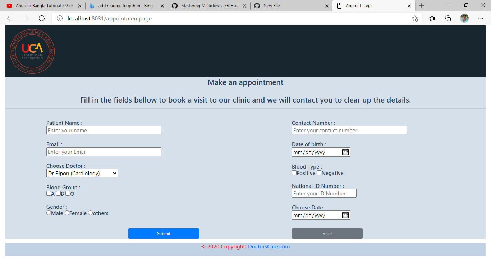
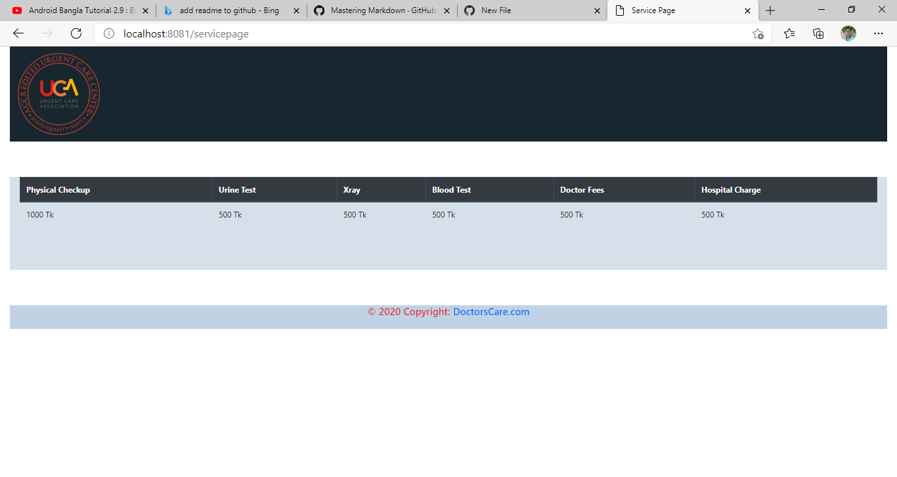
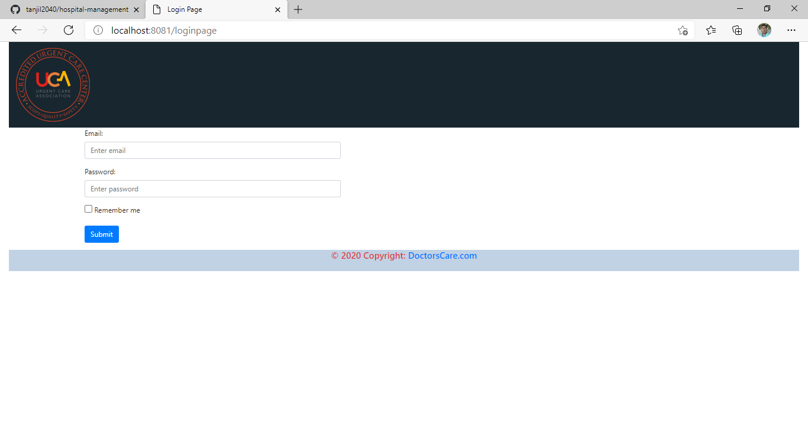
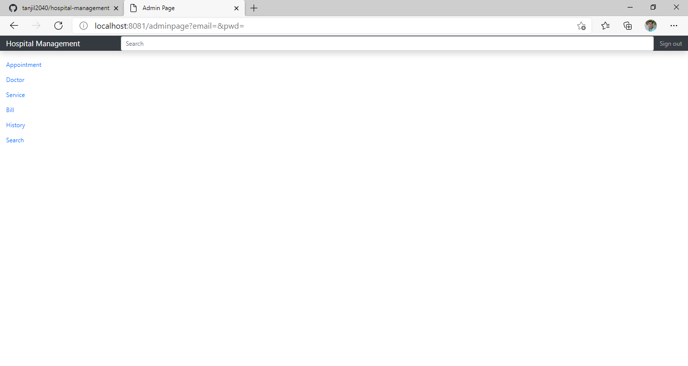
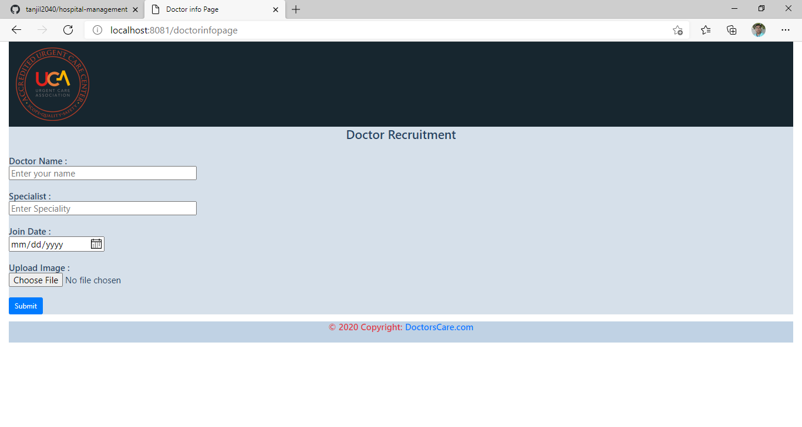
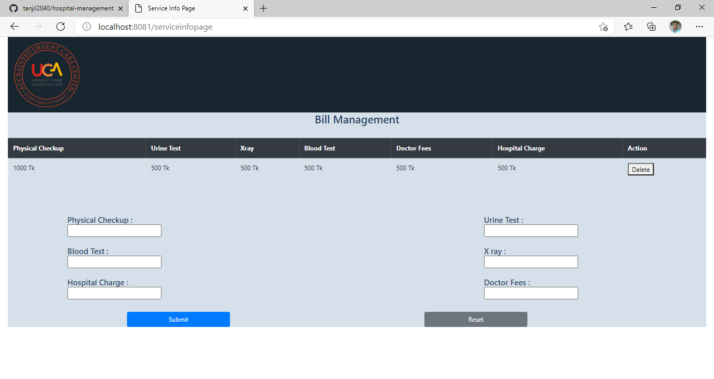
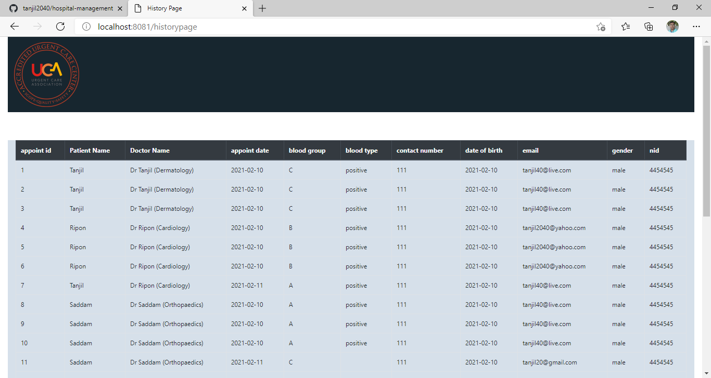
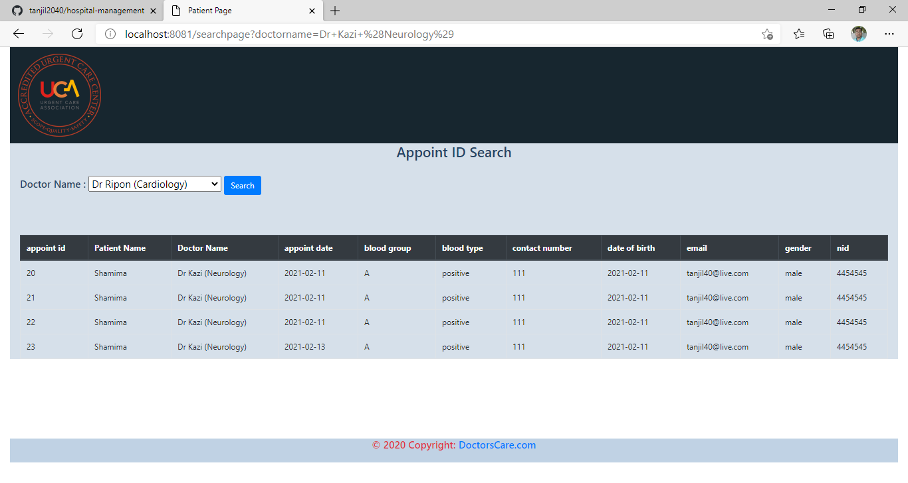

# Hospital Management

## I use Springboot, Maven, Java, JavaScript, and Bootstrap to make this project which is currently ongoing

### Some Screenshots of my project

### This page will come first where user and admin button can be seen

### This page will come after entering user module where user can see Doctor, Appointment, and Service in upper navigation area.

### This page will come after pressing Doctor button where user can see the doctors and their specialities

### This page will come after pressing Appointment button where user can make appointment

### This page will come after pressing Service button where user can see the services and their fees

### This is login page for admin

### This is dashboard page for admin to do some activities

### This is Doctor Recruitment page where admin can add doctor

### This is bill management page where admin can change current bill package

### This is history page where admin see all the appointment activities

### This is search page where admin can search specific history of a doctor

